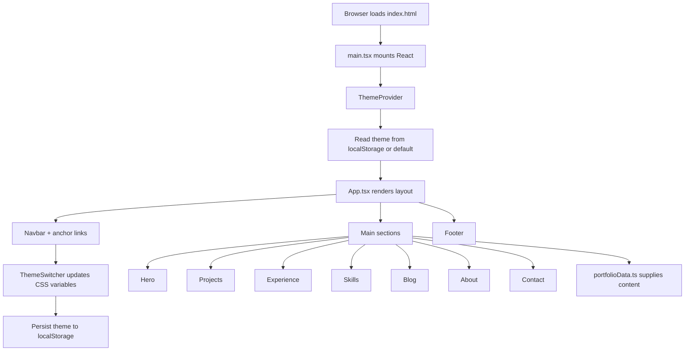

# Siddhesh Patil — Personal Portfolio

A modern, single-page portfolio website showcasing projects, experience, skills, and contact information. Built with React and TypeScript, styled with Tailwind CSS, and deployed on Vercel.

**Live site:** [https://siddhesh-portfolio-ashy.vercel.app/](https://siddhesh-portfolio-ashy.vercel.app/)

---

## Overview

This repository contains a responsive portfolio for **Siddhesh Patil** — Full Stack Developer & Data Scientist. The app is a client-side React SPA with themed UI, scroll-based sections, and centralized content so you can update copy and links in one place without touching layout components.

---

## Features

- **Single-page layout** — Hero, Projects, Experience, Skills, Blog, About, and Contact sections with anchor navigation
- **4 switchable themes** — Ocean White, Deep Space, Editorial Beige (default), Midnight Glass; preference saved in `localStorage`
- **Centralized content** — All text, links, and section data live in `portfolio/src/data/portfolioData.ts`
- **Visual polish** — Custom cursor, particle background, and fade-in-on-scroll animations
- **Responsive design** — Mobile-friendly navbar with collapsible menu
- **Type-safe** — TypeScript across components, themes, and data models

---

## Tech Stack

| Layer | Technology |
|-------|------------|
| UI framework | [React 19](https://react.dev/) |
| Language | [TypeScript](https://www.typescriptlang.org/) |
| Build tool | [Vite 7](https://vite.dev/) |
| Styling | [Tailwind CSS 4](https://tailwindcss.com/) (`@tailwindcss/vite`) |
| Linting | ESLint 9 + TypeScript ESLint |
| Deployment | [Vercel](https://vercel.com/) |

---

## Application Flow



### Runtime behavior

1. **Bootstrap** — Vite serves the app; `main.tsx` renders `App` inside `ThemeProvider`.
2. **Theme** — `ThemeContext` loads the saved theme (or Editorial Beige), applies CSS variables, and exposes `setTheme` to the navbar switcher.
3. **Navigation** — Navbar links scroll to section IDs (`#home`, `#projects`, etc.) defined in `navigationData`.
4. **Content** — Each section reads from `portfolioData.ts` (personal info, projects, experience, skills, about, contact, footer).
5. **Effects** — `CustomCursor` and `ParticleBackground` enhance the UI; `FadeInOnScroll` animates sections as they enter the viewport.

---

## Project Structure

```
siddhesh-portfolio/
├── vercel.json              # Vercel build config (app lives in portfolio/)
├── README.md
└── portfolio/               # Vite + React application
    ├── index.html
    ├── package.json
    ├── vite.config.ts
    ├── public/              # Static assets (e.g. hero video)
    └── src/
        ├── main.tsx
        ├── App.tsx          # Section composition
        ├── App.css
        ├── data/
        │   └── portfolioData.ts   # All portfolio content
        ├── context/
        │   └── ThemeContext.tsx
        ├── themes/          # Theme token definitions
        ├── types/
        ├── hooks/
        │   └── useTheme.ts
        └── components/
            ├── layout/      # Navbar, Footer
            ├── sections/    # Hero, Projects, Experience, etc.
            ├── ui/          # Buttons, cards, forms
            ├── theme/       # ThemeSwitcher
            └── effects/     # Cursor, particles
```

---

## Getting Started

### Prerequisites

- [Node.js](https://nodejs.org/) 18+ (20+ recommended)
- npm

### Install and run locally

```bash
cd portfolio
npm install
npm run dev
```

Open the URL shown in the terminal (typically `http://localhost:5173`).

### Other scripts

| Command | Description |
|---------|-------------|
| `npm run build` | Type-check and production build to `dist/` |
| `npm run preview` | Preview the production build locally |
| `npm run lint` | Run ESLint |

---

## Customization

### Update portfolio content

Edit `portfolio/src/data/portfolioData.ts`:

- `personalInfo` — Name, role, bio, email, phone, location
- `socialLinks` — GitHub, LinkedIn, LeetCode, portfolio URL
- `projectsData` — Project cards with tech stack and links
- `experienceData` — Work history
- `skillsData` — Skill categories
- `aboutData`, `contactData`, `navigationData`, `footerData`

### Add or change themes

1. Define tokens in `portfolio/src/themes/<theme-name>.ts`
2. Register the theme in `portfolio/src/themes/index.ts`
3. Add the name to `ThemeName` in `portfolio/src/types/theme.ts`

### Hero video

Place your video at `portfolio/public/hero-video.mp4` or update `heroData.videoUrl` in `portfolioData.ts`.

---

## Deployment

The app is deployed on **Vercel** from the `main` branch.

Because the Vite project lives in the `portfolio/` subdirectory, the repo root includes `vercel.json`:

```json
{
  "installCommand": "npm install --prefix portfolio",
  "buildCommand": "npm run build --prefix portfolio",
  "outputDirectory": "portfolio/dist"
}
```

**Alternative:** In the Vercel project dashboard, set **Root Directory** to `portfolio` and use the default Vite build settings (`npm run build`, output `dist`).

After pushing to GitHub, Vercel redeploys automatically if the project is connected.

### Contact form (SMTP)

The contact form posts to `/api/contact` (Vercel serverless function). Configure these **Environment Variables** in the Vercel project dashboard (Settings → Environment Variables):

| Variable | Example |
|----------|---------|
| `SMTP_HOST` | `smtp.gmail.com` |
| `SMTP_PORT` | `587` |
| `SMTP_USERNAME` | `siddheshp103@gmail.com` |
| `SMTP_PASSWORD` | Gmail [App Password](https://myaccount.google.com/apppasswords) (no spaces) |
| `FROM_EMAIL` | `siddheshp103@gmail.com` |
| `CONTACT_TO_EMAIL` | `siddheshp103@gmail.com` (inbox that receives submissions) |

Local testing (one port — same as production path `/api/contact`):

1. Copy `.env.example` to `.env` or `.env.local` at the **repo root** (SMTP credentials).
2. Run from repo root: `npm run dev` — or `cd portfolio && npm run dev`
3. Open **http://localhost:5173** — the contact form and UI share this port.

Production on Vercel uses the same `/api/contact` URL via `api/contact.ts`; both use shared logic in `lib/contactEmail.ts`.

---

## Author

**Siddhesh Patil**  
Full Stack Developer & Data Scientist · Mumbai, India  

- Email: siddheshp103@gmail.com  
- GitHub: [Siddhesh9022](https://github.com/Siddhesh9022)

---

## License

This project is private/personal portfolio code. All rights reserved unless otherwise noted.
